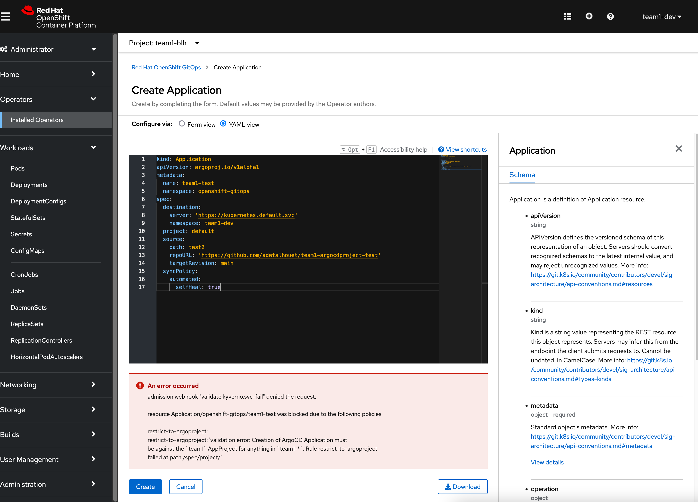
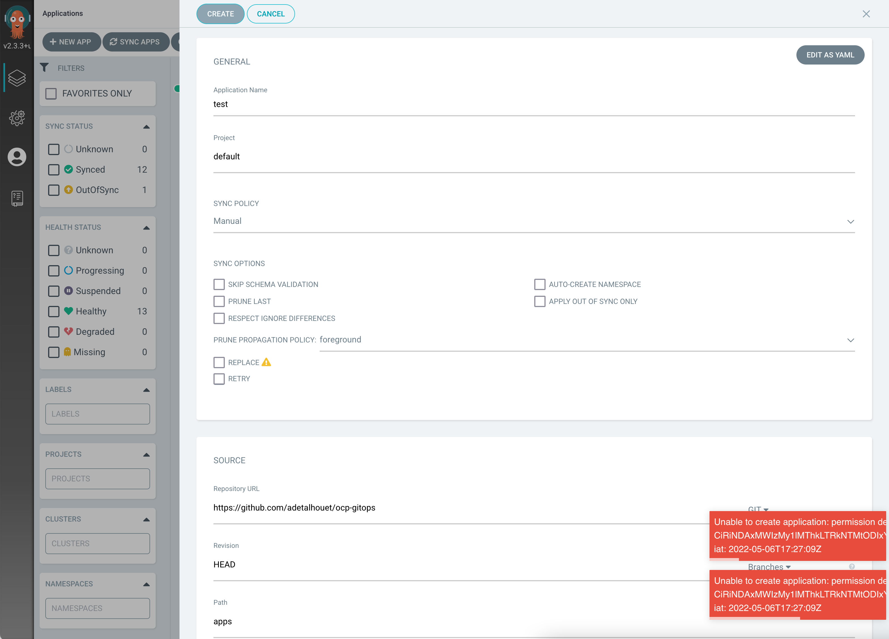
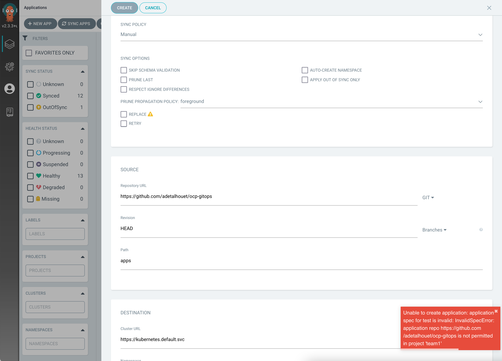
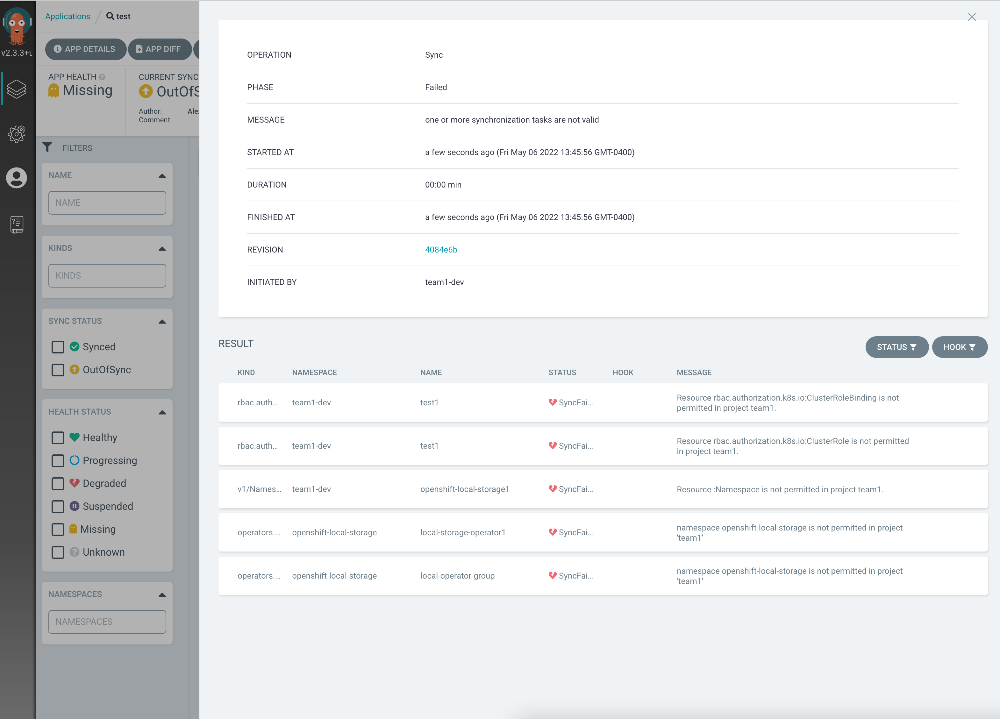

## ArgoCD AppProject testing for multi-tenancy

The goal is to assess `AppProject` to provide segragation in a multi-tenant environment.

For the testing purposes, and in order to delegate ArgoCD `Application` creation, [RBAC](rbac.yaml) file were created:
- Two groups:
    - team1-dev
    - team1-admin
- ClusterRole and ClusterRoleBinding to provide `team1-admin` group ability to create ArgoCD `Application` in `openshift-gitops` namespace, where our ArgoCD instance resides.

In order to avoid `team1-admin` to create `Application` in a different `AppProject` we are using [Kyverno](https://kyverno.io/) and created a [`ClusterPolicy`](policy.yaml) that, based on the group of the requester, will validated the expected `AppProject` to use, and will not accept the object if the `AppProject` is not properly set.

## Tests

Couple of test have been made to validate basic fonctionality of ArgoCD RBAC against AppProject, as mentioned below:
- creating an ArgoCD Application with the wrong project is blocked by Kyverno 
- namespace creation is forbidden
- installing an operator works scoped to a namespace works
- configuring wrong project result in error 
- configuring not allowed git url result in error 
- creating namespace and clusterrole is forbiden 

